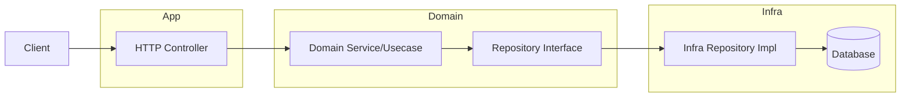
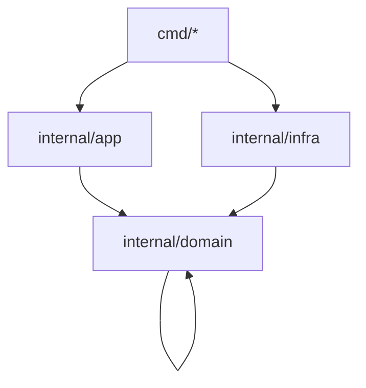

# ARCHITECTURE

## Tujuan

AITIGO adalah kerangka Go bergaya MVC-like untuk layanan HTTP. Prinsip utamanya: domain murni, controller tipis, dan detail teknis dipisah ke infra.

## Layer dan Boundary

- `internal/app/http/controller`: HTTP adapter, parsing/validasi ringan, mapping DTO.
- `internal/domain`: entity, value object, service, dan repository interface.
- `internal/infra`: technical implementation (DB, cache, external API) that fulfills the domain interfaces.
- `cmd`: wiring/entrypoint aplikasi.

## Diagram Boundary (Request -> DB)

## Diagram Aturan Dependency

## Aturan Dependency

- `internal/domain` tidak boleh import `internal/infra`, `internal/app/http`, `net/http` handler, framework router, atau DB driver.
- `internal/app` boleh import `internal/domain` dan contract interface, tidak boleh akses DB langsung.
- `internal/infra` may import `internal/domain` for interface implementations.
- Wiring dependensi hanya di `cmd/*` atau layer entrypoint.

## Pola Modul (Contoh: user)

- `internal/domain/user/entity.go` (User entity)
- `internal/domain/user/repository.go` (interface `Repository`)
- `internal/domain/user/service.go` (service/usecase)
- `internal/app/http/controller/user_controller.go` memanggil `Service`
- `internal/infra/repository/user_repo.go` mengimplement `Repository`

Alur: Controller -> Service -> Repository Interface -> Infra Repo -> DB.

## Decision Log (Ringkas)

- `internal/`: mencegah package dipakai di luar module, menjaga boundary.
- `cmd/`: entrypoint per service/binary, wiring hanya di sini.
- Repository interface di domain: agar domain tetap murni dan infra dapat diganti tanpa ubah bisnis.
- `internal/tooling/cli`: CLI generator internal untuk scaffolding tanpa dependency eksternal.
- `templates/`: aset scaffold frontend, di-embed oleh `internal/tooling/templates` karena batasan go:embed.
- `templates/gin-basic`: template Gin minimal; file Go dan go.mod/go.sum di versi embed memakai suffix `.txt` untuk menghindari batasan go:embed.
