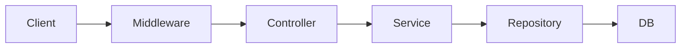

# AitiGo Docs

Quickstart

1. Install binary:

```sh
go build -o aitigo ./cmd/aitigo
```

2. Run migrations (optional):

```sh
aitigo migrate create init_schema
aitigo migrate up
```

3. Start HTTP server with middleware (example):

```sh
go run ./examples/http-middleware
```

Docs map

- `docs/middleware.md`
- `docs/middleware-requestid.md`
- `docs/middleware-recover.md`
- `docs/middleware-cors.md`
- `docs/middleware-ratelimit.md`
- `docs/observability.md`
- `docs/observability-logging.md`
- `docs/observability-tracing.md`
- `docs/observability-metrics.md`
- `docs/database.md`
- `docs/migrations.md`
- `docs/integrations.md`
- `docs/integrations-redis.md`
- `docs/integrations-s3.md`
- `docs/integrations-oidc.md`
- `docs/testing.md`
- `docs/tutorial-jwt.md`
- `docs/tutorial-clean-architecture.md`
- `docs/agent/middleware.md`
- `docs/agent/middleware-requestid.md`
- `docs/agent/middleware-recover.md`
- `docs/agent/middleware-cors.md`
- `docs/agent/middleware-ratelimit.md`
- `docs/agent/observability.md`
- `docs/agent/observability-logging.md`
- `docs/agent/observability-tracing.md`
- `docs/agent/observability-metrics.md`
- `docs/agent/migrations.md`
- `docs/agent/integrations.md`
- `docs/agent/integrations-redis.md`
- `docs/agent/integrations-s3.md`
- `docs/agent/integrations-oidc.md`
- `docs/agent/testing.md`

Architecture snapshot


