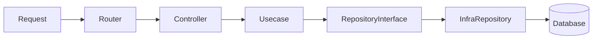

# AitiGo Structure

## Layered Architecture

AitiGo memakai arsitektur berlapis yang memisahkan HTTP adapter, domain, dan detail teknis infra. Tujuannya: domain tetap murni, controller tipis, dan implementasi teknis mudah diganti.

## Request Flow



## Dependency Rules (One-way)

- `internal/domain` berdiri sendiri, tidak mengimpor layer lain.
- `internal/app` boleh mengimpor `internal/domain`.
- `internal/infra` boleh mengimpor `internal/domain`.
- Wiring dependency hanya di `cmd/*`.

Forbidden imports (guideline):

- Domain tidak boleh import `internal/app`, `internal/infra`, `net/http`, framework router, atau driver DB.
- Controller tidak boleh import driver DB atau implementasi infra.
- Infra tidak boleh mengakses HTTP layer.

## Where to Put Code

- `internal/app/http`: routing dan controller (controller berada di `internal/app/http/controller`).
- `internal/domain`: entity, value object, interface repository, dan usecase/service.
- `internal/infra`: implementasi repository (DB/cache/external API) yang memenuhi interface domain.
- `pkg/*`: fitur framework (middleware, observability, db, migrate, integrations, testingutil).

## Error Handling

- Domain mengembalikan `DomainError` (lihat `CONVENTIONS.md`).
- Controller memetakan error domain ke HTTP status yang sesuai.
- Infra membungkus error teknis dengan konteks, tanpa mengubah aturan domain.

## Minimal Example

Controller (adapter):

```go
package controller

import (
  "context"
  "encoding/json"
  "errors"
  "net/http"

  "aitigo/internal/domain/user"
)

type UserService interface {
  GetByID(ctx context.Context, id string) (user.User, error)
}

type UserController struct {
  service UserService
}

func (c UserController) Get(w http.ResponseWriter, r *http.Request) {
  id := r.URL.Query().Get("id")
  result, err := c.service.GetByID(r.Context(), id)
  if err != nil {
    writeDomainError(w, err)
    return
  }
  writeJSON(w, http.StatusOK, result)
}

func writeDomainError(w http.ResponseWriter, err error) {
  var derr user.DomainError
  if errors.As(err, &derr) {
    http.Error(w, derr.Message, mapDomainCodeToStatus(derr.Code))
    return
  }
  http.Error(w, "internal error", http.StatusInternalServerError)
}

func writeJSON(w http.ResponseWriter, status int, payload any) {
  w.Header().Set("Content-Type", "application/json")
  w.WriteHeader(status)
  _ = json.NewEncoder(w).Encode(payload)
}

func mapDomainCodeToStatus(code string) int {
  switch code {
  case "BAD_REQUEST":
    return http.StatusBadRequest
  case "UNAUTHORIZED":
    return http.StatusUnauthorized
  case "FORBIDDEN":
    return http.StatusForbidden
  case "NOT_FOUND":
    return http.StatusNotFound
  case "CONFLICT":
    return http.StatusConflict
  default:
    return http.StatusInternalServerError
  }
}
```

Domain interface:

```go
package user

import "context"

type DomainError struct {
  Code    string
  Message string
}

type Repository interface {
  FindByID(ctx context.Context, id string) (User, error)
}
```

Infra implementation:

```go
package repository

import (
  "context"
  "database/sql"

  "aitigo/internal/domain/user"
)

type UserRepository struct {
  db *sql.DB
}

func (r UserRepository) FindByID(ctx context.Context, id string) (user.User, error) {
  // query DB, map to domain entity, wrap technical errors
  return user.User{}, nil
}
```
