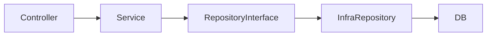

# Tutorial: Clean Architecture Layout

AitiGo uses a layered MVC-like layout:

```
internal/
  app/http/controller   # HTTP adapters
  domain                # Entities, usecases, interfaces
  infra                 # Technical implementations
cmd/                    # Wiring and entrypoints
```

Guidelines:

- Domain never imports HTTP, DB, or infra code.
- Controllers only parse and map.
- Infra implements domain interfaces.

Example flow:


